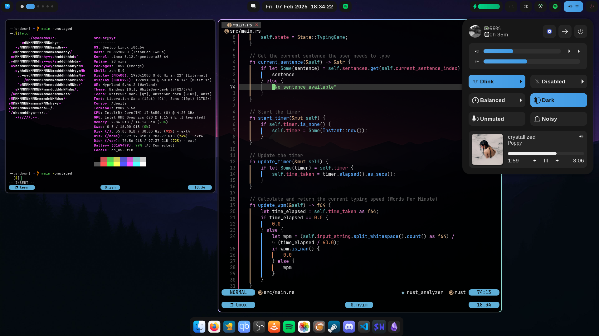

<pre>
<p align="center">
██████╗  ██████╗ ████████╗███████╗██╗██╗     ███████╗███████╗
██╔══██╗██╔═══██╗╚══██╔══╝██╔════╝██║██║     ██╔════╝██╔════╝
██║  ██║██║   ██║   ██║   █████╗  ██║██║     █████╗  ███████╗
██║  ██║██║   ██║   ██║   ██╔══╝  ██║██║     ██╔══╝  ╚════██║
██████╔╝╚██████╔╝   ██║   ██║     ██║███████╗███████╗███████║
╚═════╝  ╚═════╝    ╚═╝   ╚═╝     ╚═╝╚══════╝╚══════╝╚══════╝
</p>
</pre>

<h3 align="center">
Welcome, and make yourself at <b><i>$HOME</i></b>
</h3>



> Agnostic/cross-platform dotfiles (Linux/MacOS/Windows)


- This repository is designed to be a bare Git dotfiles repository located in home directory/work-tree.
- Easy dotfiles management that respects the file hierarchy/XDG structure of the platform.
- Custom `config` command that intelligently manages files across different operating systems.

---

## Details

Linux:
- **OS:** [Gentoo Hardened](https://www.gentoo.org)
- **WM/Compositor:** [hyprland](https://hyprland.org)
- **Widgets:** [ags](https://aylur.github.io/ags)
- **Shell:** [zsh](https://zsh.org)
- **Terminal:** [wezterm](https://https://wezfurlong.org/wezterm)
- **Multiplexer:** [tmux](https://github.com/tmux/tmux/wiki)
- **Editor:** [neovim](https://neovim.io)
  - **Config:** [nvim](https://github.com/srdusr/nvim)
- **Fonts:**
  - **Icons:** Whitesur
  - **UI:** San Francisco
  - **Terminal:** JetBrains Mono

---

## Installation Methods

### Method 1: Shell Scripts (Recommended)

**Linux/macOS:**
```sh
# Requires `curl` to be installed
curl -fsSL https://raw.githubusercontent.com/srdusr/dotfiles/main/common/install.sh | bash

# or
curl -fsSL https://raw.githubusercontent.com/srdusr/dotfiles/main/common/install.sh -o install.sh
chmod +x install.sh
./install.sh
```

**Windows PowerShell:**
```powershell
iex ((New-Object System.Net.WebClient).DownloadString('https://raw.githubusercontent.com/srdusr/dotfiles/main/windows/Documents/PowerShell/bootstrap.ps1'))

# or

$bat = "$env:TEMP\install.bat"
Invoke-WebRequest -Uri "https://raw.githubusercontent.com/srdusr/dotfiles/main/windows/install.bat" -OutFile $bat
cmd /c $bat
```

### Method 2: Ansible Automation

Alternative to the shell scripts for managing multiple machines:

```bash
# Clone repository
git clone https://github.com/srdusr/dotfiles.git
cd dotfiles/ansible

# Install Ansible
pip install ansible

# Deploy to localhost (replaces install.sh/bootstrap.ps1)
ansible-playbook -i inventory.yml playbook.yml -e dotfiles_profile=dev

# Deploy to remote hosts
ansible-playbook -i inventory.yml playbook.yml --limit linux
```

### Method 3: Installing onto a new system (Manual)

1. Avoid weird behaviour/recursion issues when `.cfg` tries to track itself

```bash
echo ".cfg" >> .gitignore
```

2. Clone the repository

```bash
# Linux/MacOS/WSL
git clone --bare https://github.com/srdusr/dotfiles.git $HOME/.cfg
```

```ps1
# Windows (PowerShell)
git clone --bare https://github.com/srdusr/dotfiles.git $env:USERPROFILE/.cfg
```

<a name="config-example"></a>

3. Setup the `config` command/function

**Linux/macOS:**
Copy and paste the following snippet to any profile/startup file ie. `~/.bashrc`, `~/.zshrc` etc.

<details>
  <summary><b>Bash/Zsh:</b> (click here)</summary>

```bash
# Dotfiles Management System
if [[ -d "$HOME/.cfg" && -d "$HOME/.cfg/refs" ]]; then
    # Core git wrapper - .cfg is bare repo, work-tree points to .cfg itself
    _config() {
        git --git-dir="$HOME/.cfg" --work-tree="$HOME/.cfg" "$@"
    }

    # Detect OS
    case "$(uname -s)" in
        Linux)   CFG_OS="linux" ;;
        Darwin)  CFG_OS="macos" ;;
        MINGW*|MSYS*|CYGWIN*) CFG_OS="windows" ;;
        *)       CFG_OS="other" ;;
    esac

    _repo_path() {
        local f="$1"

        # Normalize absolute or relative
        if [[ "$f" == "$HOME/"* ]]; then
            f="${f#$HOME/}"
        elif [[ "$f" == "./"* ]]; then
            f="${f#./}"
        fi

        # Already tracked? Use that
        local dirs=("common/" "$CFG_OS/home/" "$CFG_OS/Users/")
        for d in "${dirs[@]}"; do
            local match="$(_config ls-files --full-name | grep -F "/$f" | grep -F "$d" || true)"
            if [[ -n "$match" ]]; then
                echo "$match"
                return
            fi
        done

        # Already a special repo path
        case "$f" in
            common/*|"$CFG_OS/home/"*|"$CFG_OS/Users/"*|profile/*|README.md)
                echo "$f"
                return
                ;;
        esac

        # Map everything else dynamically
        case "$f" in
            *)
                case "$CFG_OS" in
                    linux)   echo "linux/home/$f" ;;
                    macos)   echo "macos/Users/$f" ;;
                    windows) echo "windows/Users/$f" ;;
                    *)       echo "$CFG_OS/home/$f" ;;
                esac
                ;;
        esac
    }

    _sys_path() {
        local repo_path="$1"

        # System HOME
        local sys_home
        case "$CFG_OS" in
            linux|macos) sys_home="$HOME" ;;
            windows)     sys_home="$USERPROFILE" ;;
        esac

        # Repo HOME roots
        local repo_home
        case "$CFG_OS" in
            linux)   repo_home="linux/home" ;;
            macos)   repo_home="macos/Users" ;;
            windows) repo_home="windows/Users" ;;
        esac

        case "$repo_path" in
            # Common files → $HOME/… but normalize well-known dirs
            common/*)
                local rel="${repo_path#common/}"

                case "$rel" in
                    # XDG config
                    .config/*|config/*)
                        local sub="${rel#*.config/}"
                        sub="${sub#config/}"
                        echo "${XDG_CONFIG_HOME:-$sys_home/.config}/$sub"
                        ;;

                    # XDG data (assets, wallpapers, icons, fonts…)
                    assets/*|.local/share/*)
                        local sub="${rel#assets/}"
                        sub="${sub#.local/share/}"
                        echo "${XDG_DATA_HOME:-$sys_home/.local/share}/$sub"
                        ;;

                    # XDG cache (if you ever store cached scripts/config)
                    .cache/*)
                        local sub="${rel#.cache/}"
                        echo "${XDG_CACHE_HOME:-$sys_home/.cache}/$sub"
                        ;;

                    # Scripts
                    .scripts/*|scripts/*)
                        local sub="${rel#*.scripts/}"
                        sub="${sub#scripts/}"
                        echo "$sys_home/.scripts/$sub"
                        ;;

                    # Default: dump directly under $HOME
                    *)
                        echo "$sys_home/$rel"
                        ;;
                esac
                ;;

            # Profile files → $HOME/…
            profile/*)
                local rel="${repo_path#profile/}"
                echo "$sys_home/$rel"
                ;;

            # OS-specific home paths → $HOME or $USERPROFILE
            "$repo_home"/*)
                local rel="${repo_path#$repo_home/}"
                echo "$sys_home/$rel"
                ;;

            # OS-specific system paths outside home/Users → absolute
            "$CFG_OS/"*)
                local rel="${repo_path#$CFG_OS/}"
                echo "/$rel"
                ;;

            # Fallback: treat as repo-only
            *)
                echo "$HOME/.cfg/$repo_path"
                ;;
        esac
    }

    # Prompts for sudo if needed and runs the command
    _sudo_prompt() {
        if [[ $EUID -eq 0 ]]; then
            "$@"
        else
            if command -v sudo >/dev/null; then
                sudo "$@"
            elif command -v doas >/dev/null; then
                doas "$@"
            elif command -v pkexec >/dev/null; then
                pkexec "$@"
            else
                echo "Error: No privilege escalation tool found."
                return 1
            fi
        fi
    }

    # Main config command
    config() {
        local cmd="$1"; shift

        case "$cmd" in
            add)
                local file_path
                local git_opts=()
                local files=()
                local target_dir=""

                # Parse optional --target flag before files
                while [[ $# -gt 0 ]]; do
                    case "$1" in
                        --target|-t)
                            target_dir="$2"
                            shift 2
                            ;;
                        -*)  # any other git flags
                            git_opts+=("$1")
                            shift
                            ;;
                        *)  # files
                            files+=("$1")
                            shift
                            ;;
                    esac
                done

                for file_path in "${files[@]}"; do
                    # Store original for rel_path calculation
                    local original_path="$file_path"

                    # Make path absolute first
                    if [[ "$file_path" != /* && "$file_path" != "$HOME/"* ]]; then
                        file_path="$(pwd)/$file_path"
                    fi

                    # Check if file exists
                    if [[ ! -e "$file_path" ]]; then
                        echo "Error: File not found: $file_path"
                        continue
                    fi

                    # Calculate relative path from original input
                    local rel_path
                    if [[ "$original_path" == "$HOME/"* ]]; then
                        rel_path="${original_path#$HOME/}"
                    elif [[ "$original_path" == "./"* ]]; then
                        rel_path="${original_path#./}"
                    else
                        rel_path="$original_path"
                    fi

                    # Check if file is already tracked
                    local existing_path="$(_config ls-files --full-name | grep -Fx "$(_repo_path "$file_path")" || true)"
                    local repo_path
                    if [[ -n "$existing_path" ]]; then
                        repo_path="$existing_path"
                    elif [[ -n "$target_dir" ]]; then
                        repo_path="$target_dir/$rel_path"
                    else
                        repo_path="$(_repo_path "$file_path")"
                    fi

                    # Copy file into bare repo
                    local full_repo_path="$HOME/.cfg/$repo_path"
                    mkdir -p "$(dirname "$full_repo_path")"
                    cp -a "$file_path" "$full_repo_path"

                    # Add to git
                    _config add "${git_opts[@]}" "$repo_path"

                    echo "Added: $file_path -> $repo_path"
                done
                ;;

            rm)
                local rm_opts=""
                local file_path_list=()
                local target_dir=""

                # Parse options
                while [[ $# -gt 0 ]]; do
                    case "$1" in
                        --target|-t)
                            target_dir="$2"
                            shift 2
                            ;;
                        -*)
                            rm_opts+=" $1"
                            shift
                            ;;
                        *)
                            file_path_list+=("$1")
                            shift
                            ;;
                    esac
                done

                for file_path in "${file_path_list[@]}"; do
                    local repo_path
                    # Check if already a repo path (exists in git index) - exact match
                    if _config ls-files --full-name | grep -qFx "$file_path"; then
                        repo_path="$file_path"
                    elif [[ -n "$target_dir" ]]; then
                        # Use target directory if specified
                        local rel_path
                        if [[ "$file_path" == "$HOME/"* ]]; then
                            rel_path="${file_path#$HOME/}"
                        else
                            rel_path="${file_path#./}"
                        fi
                        repo_path="$target_dir/$rel_path"
                    else
                        repo_path="$(_repo_path "$file_path")"
                    fi

                    if [[ "$rm_opts" == *"-r"* ]]; then
                        _config rm --cached -r "$repo_path"
                    else
                        _config rm --cached "$repo_path"
                    fi

                    # Compute system path for actual file removal
                    local sys_file="$(_sys_path "$repo_path")"
                    if [[ -e "$sys_file" ]]; then
                        eval "rm $rm_opts \"$sys_file\""
                    fi
                    echo "Removed: $repo_path"
                done
                ;;

            sync)
                local direction="${1:-to-repo}"; shift
                _config ls-files | while read -r repo_file; do
                    local sys_file="$(_sys_path "$repo_file")"
                    local full_repo_path="$HOME/.cfg/$repo_file"

                    if [[ "$direction" == "to-repo" ]]; then
                        if [[ -e "$sys_file" && -n "$(diff "$full_repo_path" "$sys_file" 2>/dev/null || echo "diff")" ]]; then
                            cp -a "$sys_file" "$full_repo_path"
                            echo "Synced to repo: $sys_file"
                        fi
                    elif [[ "$direction" == "from-repo" ]]; then
                        if [[ -e "$full_repo_path" && -n "$(diff "$full_repo_path" "$sys_file" 2>/dev/null || echo "diff")" ]]; then
                            local dest_dir="$(dirname "$sys_file")"
                            if [[ "$sys_file" == /* && "$sys_file" != "$HOME/"* ]]; then
                                _sudo_prompt mkdir -p "$dest_dir"
                                _sudo_prompt cp -a "$full_repo_path" "$sys_file"
                            else
                                mkdir -p "$dest_dir"
                                cp -a "$full_repo_path" "$sys_file"
                            fi
                            echo "Synced from repo: $sys_file"
                        fi
                    fi
                done
                ;;

            status)
                local modified_files=()
                local missing_files=()

                # Colors like git
                local RED="\033[31m"
                local GREEN="\033[32m"
                local YELLOW="\033[33m"
                local BLUE="\033[34m"
                local BOLD="\033[1m"
                local RESET="\033[0m"

                while read -r repo_file; do
                    local sys_file="$(_sys_path "$repo_file")"
                    local full_repo_path="$HOME/.cfg/$repo_file"

                    if [[ ! -e "$full_repo_path" ]]; then
                        missing_files+=("$repo_file")
                    elif [[ -e "$sys_file" ]]; then
                        if ! diff -q "$full_repo_path" "$sys_file" >/dev/null 2>&1; then
                            modified_files+=("$repo_file")
                        fi
                    fi
                done < <(_config ls-files)

                # Report missing files
                if [[ ${#missing_files[@]} -gt 0 ]]; then
                    echo -e "${BOLD}${RED}=== Missing Files (consider removing from git) ===${RESET}"
                    for repo_file in "${missing_files[@]}"; do
                        echo -e " ${RED}deleted:${RESET}   $(_sys_path "$repo_file") -> $repo_file"
                    done
                    echo
                fi

                # Report modified files
                if [[ ${#modified_files[@]} -gt 0 ]]; then
                    echo -e "${BOLD}${YELLOW}=== Modified Files (different from system) ===${RESET}"
                    for repo_file in "${modified_files[@]}"; do
                        echo -e " ${YELLOW}modified:${RESET}  $(_sys_path "$repo_file") -> $repo_file"
                    done
                    echo
                fi

                # Finally, show underlying git status (with colors)
                _config -c color.status=always status
                ;;

            deploy|checkout)
                echo "Deploying dotfiles from .cfg..."
                _config ls-files | while read -r repo_file; do
                    local full_repo_path="$HOME/.cfg/$repo_file"
                    local sys_file="$(_sys_path "$repo_file")"

                    # Only continue if the source exists
                    if [[ -e "$full_repo_path" && -n "$sys_file" ]]; then
                        local dest_dir
                        dest_dir="$(dirname "$sys_file")"

                        # Create destination if needed
                        if [[ "$sys_file" == /* && "$sys_file" != "$HOME/"* ]]; then
                            _sudo_prompt mkdir -p "$dest_dir"
                            _sudo_prompt cp -a "$full_repo_path" "$sys_file"
                        else
                            mkdir -p "$dest_dir"
                            cp -a "$full_repo_path" "$sys_file"
                        fi

                        echo "Deployed: $repo_file -> $sys_file"
                    fi
                done
                ;;

            backup)
                local timestamp=$(date +%Y%m%d%H%M%S)
                local backup_dir="$HOME/.dotfiles_backup/$timestamp"
                echo "Backing up existing dotfiles to $backup_dir..."

                _config ls-files | while read -r repo_file; do
                    local sys_file="$(_sys_path "$repo_file")"
                    if [[ -e "$sys_file" ]]; then
                        local dest_dir_full="$backup_dir/$(dirname "$repo_file")"
                        mkdir -p "$dest_dir_full"
                        cp -a "$sys_file" "$backup_dir/$repo_file"
                    fi
                done
                echo "Backup complete. To restore, copy files from $backup_dir to their original locations."
                ;;

            *)
                _config "$cmd" "$@"
                ;;
        esac
    }
fi
```

  </details>


**Windows PowerShell:**
Paste the PowerShell code block directly into your PowerShell profile. 
To find your profile path, simply run `$PROFILE` in your terminal. You can open and edit it with `notepad $PROFILE`.
If the file doesn't exist, you can create it.
```ps1
New-Item -Path $PROFILE -ItemType File -Force
```

<details>
  <summary><b>PowerShell:</b> (click here)</summary>

```ps1
# Dotfiles Management System
if (Test-Path "$HOME\.cfg" -and Test-Path "$HOME\.cfg\refs") {

    # Core git wrapper with repository as work-tree
    function _config {
        param(
            [Parameter(Mandatory=$true, ValueFromRemainingArguments=$true)]
            [String[]]$Args
        )
        git --git-dir="$HOME\.cfg" --work-tree="$HOME" @Args
    }

    # Detect OS (cross-platform, PowerShell-native)
    $osPlatform = [System.Runtime.InteropServices.RuntimeInformation]::IsOSPlatform
    if ($osPlatform([System.Runtime.InteropServices.OSPlatform]::Windows)) {
        $global:CFG_OS = "windows"
    } elseif ($osPlatform([System.Runtime.InteropServices.OSPlatform]::Linux)) {
        $global:CFG_OS = "linux"
    } elseif ($osPlatform([System.Runtime.InteropServices.OSPlatform]::OSX)) {
        $global:CFG_OS = "macos"
    } else {
        $global:CFG_OS = "other"
    }

    # Map system path to repository path
    function _repo_path {
        param([string]$FilePath)

        $repoPath = ""
        # Handle absolute paths outside the user's home directory
        if ($FilePath.StartsWith("\") -or $FilePath.Contains(":")) {
            $repoPath = "$CFG_OS\root\$FilePath"
            return $repoPath -replace '\\', '/'
        }

        $homePath = "$HOME"
        # Check if file is in the home directory
        if ($FilePath.StartsWith($homePath)) {
            $relativePath = $FilePath.Substring($homePath.Length + 1)
            # Check for paths that are explicitly within the repo structure
            switch -wildcard ($FilePath) {
                "$HOME\.cfg\*" { $repoPath = "" }
                "common\*"    { $repoPath = $FilePath }
                "$CFG_OS\*"   { $repoPath = $FilePath }
                default       { $repoPath = "$CFG_OS\home\$relativePath" }
            }
        } else {
            # Default for relative paths (assumes they are in the home directory)
            $repoPath = "$CFG_OS\home\$FilePath"
        }
        
        # Clean up path separators
        return $repoPath -replace '\\', '/'
    }

    # Map repository path back to system path
    function _sys_path {
        param([string]$RepoPath)

        $sysPath = ""
        switch -wildcard ($RepoPath) {
            "common/config/*" {
                $file = $RepoPath.Substring("common/config/".Length)
                if ($CFG_OS -eq "windows") {
                    $sysPath = Join-Path $HOME "AppData\Local\$file"
                } else {
                    $sysPath = Join-Path $HOME ".config\$file"
                }
            }
            "common/bin/*" {
                $file = $RepoPath.Substring("common/bin/".Length)
                if ($CFG_OS -eq "windows") {
                    $sysPath = Join-Path $HOME "bin\$file"
                } else {
                    $sysPath = Join-Path $HOME ".local\bin\$file"
                }
            }
            "common/*" {
                $file = $RepoPath.Substring("common/".Length)
                $sysPath = Join-Path $HOME $file
            }
            "*/home/*" {
                $file = $RepoPath.Substring($RepoPath.IndexOf("home/") + "home/".Length)
                $sysPath = Join-Path $HOME $file
            }
            "*/root/*" {
                $file = $RepoPath.Substring($RepoPath.IndexOf("root/") + "root/".Length)
                $sysPath = $file
            }
            default {
                $sysPath = Join-Path $HOME $RepoPath
            }
        }
        return $sysPath -replace '/', '\'
    }

    # Prompts for administrator permissions if needed and runs the command
    function _admin_prompt {
        param(
            [Parameter(Mandatory=$true, ValueFromRemainingArguments=$true)]
            [String[]]$Command
        )
        if (-not ([Security.Principal.WindowsPrincipal][Security.Principal.WindowsIdentity]::GetCurrent()).IsInRole([Security.Principal.WindowsBuiltInRole]::Administrator)) {
            Write-Host "Warning: This action requires administrator privileges."
            Start-Process powershell.exe -ArgumentList "-NoProfile", "-Command", "Set-Location '$PWD'; & $Command" -Verb RunAs
        } else {
            & $Command
        }
    }

    # NOTE: can change `config` to whatever you feel comfortable ie. dotfiles, dots, cfg etc.
    function config {
        param(
            [string]$Command,
            [Parameter(ValueFromRemainingArguments=$true)]
            [string[]]$Args
        )

        switch ($Command) {
            "add" {
                foreach ($file in $Args) {
                    $repoPath = _repo_path $file
                    if ([string]::IsNullOrEmpty($repoPath)) {
                        Write-Host "Warning: Ignoring file within the bare repo: $file"
                        continue
                    }
                    $fullRepoPath = Join-Path "$HOME\.cfg" $repoPath
                    $dir = Split-Path $fullRepoPath
                    if (-not (Test-Path $dir)) { New-Item -ItemType Directory -Path $dir | Out-Null }
                    Copy-Item -Path $file -Destination $fullRepoPath -Recurse -Force
                    _config add $repoPath
                    Write-Host "Added: $file -> $repoPath"
                }
            }

            "rm" {
                foreach ($file in $Args) {
                    $repoPath = _repo_path $file
                    _config rm $repoPath
                    Remove-Item -Path (Join-Path "$HOME\.cfg" $repoPath) -Force
                    Write-Host "Removed: $file ($repoPath)"
                }
            }

            "sync" {
                $direction = if ($Args) { $Args[0] } else { "to-repo" }
                _config ls-files | ForEach-Object {
                    $repoFile = $_
                    $sysFile = _sys_path $repoFile
                    $fullRepoPath = Join-Path "$HOME\.cfg" $repoFile
                    if ($direction -eq "to-repo") {
                        if ((Test-Path $sysFile) -and ((Get-Content $fullRepoPath) -ne (Get-Content $sysFile))) {
                            Copy-Item $sysFile $fullRepoPath -Force
                            Write-Host "Synced to repo: $sysFile"
                        }
                    } elseif ($direction -eq "from-repo") {
                        if ((Test-Path $fullRepoPath) -and ((Get-Content $fullRepoPath) -ne (Get-Content $sysFile))) {
                            $destDir = Split-Path $sysFile
                            if ($sysFile.StartsWith('\') -or $sysFile.Contains(':')) {
                                _admin_prompt Copy-Item $fullRepoPath $sysFile -Recurse -Force
                            } else {
                                if (-not (Test-Path $destDir)) { New-Item -ItemType Directory -Path $destDir | Out-Null }
                                Copy-Item $fullRepoPath $sysFile -Recurse -Force
                            }
                            Write-Host "Synced from repo: $sysFile"
                        }
                    }
                }
            }
            
            "status" {
                $autoSynced = @()
                _config ls-files | ForEach-Object {
                    $repoFile = $_
                    $sysFile = _sys_path $repoFile
                    $fullRepoPath = Join-Path "$HOME\.cfg" $repoFile
                    if ((Test-Path $sysFile) -and (Test-Path $fullRepoPath)) {
                        if ((Get-Content $fullRepoPath) -ne (Get-Content $sysFile)) {
                            Copy-Item $sysFile $fullRepoPath -Force
                            $autoSynced += $repoFile
                        }
                    }
                }
                if ($autoSynced.Count -gt 0) {
                    Write-Host "=== Auto-synced Files ==="
                    foreach ($repoFile in $autoSynced) {
                        Write-Host "synced: $(_sys_path $repoFile) → $repoFile"
                    }
                    Write-Host
                }
                _config status
            }

            "deploy" {
                _config ls-files | ForEach-Object {
                    $repoFile = $_
                    $sysFile = _sys_path $repoFile
                    $fullRepoPath = Join-Path "$HOME\.cfg" $repoFile
                    if (Test-Path $fullRepoPath) {
                        if (-not [string]::IsNullOrEmpty($sysFile)) {
                            $destDir = Split-Path $sysFile
                            if ($sysFile.StartsWith('\') -or $sysFile.Contains(':')) {
                                _admin_prompt Copy-Item $fullRepoPath $sysFile -Recurse -Force
                            } else {
                                if (-not (Test-Path $destDir)) { New-Item -ItemType Directory -Path $destDir | Out-Null }
                                Copy-Item $fullRepoPath $sysFile -Recurse -Force
                            }
                            Write-Host "Deployed: $repoFile -> $sysFile"
                        }
                    }
                }
            }
            
            "backup" {
                $timestamp = Get-Date -Format "yyyyMMddHHmmss"
                $backupDir = Join-Path $HOME ".dotfiles_backup\$timestamp"
                Write-Host "Backing up existing dotfiles to $backupDir..."
                
                _config ls-files | ForEach-Object {
                    $repoFile = $_
                    $sysFile = _sys_path $repoFile
                    if (Test-Path $sysFile) {
                        $destDirFull = Join-Path $backupDir $repoFile
                        if (-not (Test-Path $destDirFull)) { New-Item -ItemType Directory -Path $destDirFull -Force | Out-Null }
                        Copy-Item $sysFile $destDirFull -Recurse -Force
                    }
                }
                Write-Host "Backup complete. To restore, copy files from $backupDir to their original locations."
            }

            default {
                _config $Command @Args
            }
        }
    }
}
```

  </details>

Restart the terminal or source the session profile file used.


4. Checkout dotfiles from the repository

**Important:** After cloning the bare repository, you need to checkout the files to restore the directory structure:

```bash
config checkout
```

If you get conflicts about existing files, you can force the checkout:

```bash
config checkout -f
```


5. Configure repository settings

```bash
config config --local status.showUntrackedFiles no
```

6. Deploy dotfiles to system locations

```bash
config deploy
```

**Note:** All installation methods include:
- System hardening and security configurations
- Kernel/OS/distribution update checking
- Profile-based package installation
- Development environment setup

---

## Usage Examples

### Adding Files to Your Dotfiles

```bash
# Add a config file explicitly to the common directory in the repo
config add --target common .bashrc

# Add with a specific target directory
config add --target windows ~/Documents/PowerShell/Microsoft.PowerShell_profile.ps1

# Windows:
config add --target windows "$env:USERPROFILE\Documents\PowerShell\Microsoft.PowerShell_profile.ps1"

# Linux WSL or Git Bash:
config add --target windows /mnt/c/Users/`username`/Documents/PowerShell/Microsoft.PowerShell_profile.ps1

# Add multiple files at once (each will be mapped appropriately)
config add ~/.vim .tmux.conf # Will go to OS's home

# Add files outside of home
config add --target linux/etc /etc/issue

```
---

<details>
  <summary><b>Setup/guide</b> (If you have time to read)</summary>

### Dotfiles Setup


1. Initialize a Bare Repository

First, set up a bare Git repository in your home directory. A bare repository contains only the internal Git metadata (like commit history and branches) without a checked-out copy of your files. This is perfect for dotfiles because it lets Git manage files directly in your home directory without cluttering it with a visible .git folder.

```bash
# Bash/Zsh:
cd ~
git init --bare $HOME/.cfg 
```

```ps1
# PowerShell:
Set-Location $HOME 
git init --bare "$HOME\.cfg"
```

2. Create the Directory Structure

To keep your dotfiles organized and easily managed across platforms, create subdirectories for common and OS-specific files. This structure allows the `config` command to automatically place files in the correct location.

```bash
# Bash/Zsh:
mkdir -p $HOME/.cfg/{common,linux,macos,profile,windows}
```

```ps1
# PowerShell:
New-Item -ItemType Directory -Force -Path "$HOME\.cfg\common","$HOME\.cfg\linux","$HOME\.cfg\macos","$HOME\.cfg\profile","$HOME\.cfg\windows"
```

3. Create `config` command by pasting this into relevant profile file ie, `.bashrc`, `.zshrc`, `profile.ps1` and restarting the terminal
[config command:](#config-example)

4. Hide untracked files

```bash
config config --local status.showUntrackedFiles no
  ```

5. Add Files to Your Repository

Now you can use the `config` command to add your dotfiles. The `config add` command copies the file from your system into the correct folder within your bare repository and stages it for a Git commit.

To add a file specific to your operating system:

```bash
# Bash/Zsh:
config add --target common .bashrc # Added to $HOME/.cfg/common/.bashrc
```

```bash
# PowerShell:
config add $PROFILE
```

The `config` command intelligently determines the correct subdirectory based on OS and the file's location.

To add a file from the repository's root, like a README.md:

```bash
# Bash/Zsh:
config add $HOME/.cfg/README.md # This is added to the root of your repo
```

```bash
# PowerShell:
config add "$HOME\.cfg\README.md"
```

This works because `config` is configured to recognize and handle files explicitly within the .cfg directory.
Can also specify/edit/add other other OS/common or outside of home directory by providing a path relative in .cfg/

To add a common file:

```bash
config add $HOME/.cfg/common/.aliases # Added to $HOME/.cfg/common/.aliases
```

To add a file from outside the home directory:

```bash
# Bash/Zsh:
config add /etc/fstab # Added to $HOME/.cfg/linux/etc/fstab
```

```bash
# PowerShell:
Start-Process powershell -Verb RunAs -ArgumentList "config add C:\Windows\System32\drivers\etc\hosts"
```

NOTE: The `config` command is also capable of handling system-level configuration files that require administrator privileges. Will ask for your password/need admin privileges


6. Commit and Push

Once your files are added, you can commit them and push them to a remote repository (like GitHub or GitLab) for safekeeping and easy synchronization across your machines.

```bash
# Commit the changes
config commit -m "Initial commit of dotfiles"

# Add a remote origin (replace with your repository's URL)
config remote add origin https://github.com/<username>/dotfiles.git

# Push your changes
config push -u origin main
```

---

### Fzf

- Install Fzf

```
$ sudo git clone --depth 1 https://github.com/junegunn/fzf.git /usr/local/bin/fzf
```

- Put this into `.bashrc`/`.zshrc` or any similar shell configuration file to make it persistent across sessions

```bash
export PATH="$PATH:/usr/local/bin/fzf/bin"
export FZF_BASE="/usr/local/bin/fzf"
```

- Also put this in to load fzf keybindings and completions

```bash
# bash
source /usr/local/bin/fzf/shell/key-bindings.bash
source /usr/local/bin/fzf/shell/completion.bash
```

```bash
# zsh
source /usr/local/bin/fzf/shell/key-bindings.zsh
source /usr/local/bin/fzf/shell/completion.zsh
```

---

### Zsh plugins

- Install the plugins

```bash
# Clone zsh-you-should-use
$ git clone https://github.com/MichaelAquilina/zsh-you-should-use.git ~/.config/zsh/plugins/zsh-you-should-use

# Clone zsh-syntax-highlighting
$ git clone https://github.com/zsh-users/zsh-syntax-highlighting.git ~/.config/zsh/plugins/zsh-syntax-highlighting

# Clone zsh-autosuggestions
$ git clone https://github.com/zsh-users/zsh-autosuggestions.git ~/.config/zsh/plugins/zsh-autosuggestions
```

- Put this into `.zshrc` (preferably at the very end of the file) to allow it to source the plugins across sessions

```bash
# Suggest aliases for commands
source ~/.config/zsh/plugins/zsh-you-should-use/you-should-use.plugin.zsh

# Load zsh-syntax-highlighting
source ~/.config/zsh/plugins/zsh-syntax-highlighting/zsh-syntax-highlighting.zsh

# Load fish like auto suggestions
source ~/.config/zsh/plugins/zsh-autosuggestions/zsh-autosuggestions.plugin.zsh
source ~/.config/zsh/plugins/zsh-autosuggestions/zsh-autosuggestions.zsh
```

---

### Wezterm

- Make sure Rust is installed first

```bash
$ curl https://sh.rustup.rs -sSf | sh -s
```

- Install and build Wezterm

```bash
$ git clone --depth=1 --branch=main --recursive https://github.com/wez/wezterm.git
$ cd wezterm
$ git submodule update --init --recursive
$ ./get-deps
$ cargo build --release
$ cargo run --release --bin wezterm -- start
$ sudo install wezterm wezterm-gui wezterm-mux-server strip-ansi-escapes /usr/local/bin

```

---

### Neovim

> Dependencies

| Platform           | ninja-build | ninja | base-devel | build-base | coreutils | gmake | cmake | make | gcc | g++ | gcc-c++ | unzip | wget | curl | gettext | gettext-tools | gettext-tiny-dev | automake | autoconf | libtool | libtool-bin | pkg-config | pkgconfig | pkgconf | tree-sitter | patch | doxygen | sha | git | Pack Manager |
| ------------------ | ----------- | ----- | ---------- | ---------- | --------- | ----- | ----- | ---- | --- | --- | ------- | ----- | ---- | ---- | ------- | ------------- | ---------------- | -------- | -------- | ------- | ----------- | ---------- | --------- | ------- | ----------- | ----- | ------- | --- | --- | ------------ |
| Ubuntu/Debian      | ✓           |       |            |            |           |       | ✓     |      |     | ✓   |         | ✓     |      | ✓    | ✓       |               |                  | ✓        | ✓        | ✓       | ✓           | ✓          |           |         |             |       | ✓       |     |     | apt-get      |
| CentOS/RHEL/Fedora | ✓           |       |            |            |           |       | ✓     | ✓    | ✓   |     | ✓       | ✓     |      | ✓    | ✓       |               |                  | ✓        | ✓        | ✓       |             |            | ✓         |         |             | ✓     |         |     |     | dnf          |
| openSUSE           |             | ✓     |            |            |           |       | ✓     |      |     |     | ✓       |       |      | ✓    |         | ✓             |                  | ✓        | ✓        | ✓       |             |            |           |         |             |       |         |     |     | zypper       |
| Arch Linux         |             | ✓     | ✓          |            |           |       | ✓     |      |     |     |         | ✓     |      | ✓    |         |               |                  |          |          |         |             |            |           |         | ✓           |       |         |     |     | pacman       |
| Alpine Linux       |             |       |            |            | ✓         |       | ✓     |      |     |     |         | ✓     |      | ✓    |         |               | ✓                | ✓        | ✓        | ✓       |             |            |           | ✓       |             |       |         |     |     | apk          |
| Void Linux         |             |       | ✓          | ✓          |           |       | ✓     |      |     |     |         |       |      | ✓    |         |               |                  |          |          |         |             |            |           |         |             |       |         |     | ✓   | xbps         |
| FreeBSD            |             |       |            |            |           | ✓     | ✓     |      |     |     |         | ✓     | ✓    | ✓    | ✓       |               |                  |          |          | ✓       |             |            |           | ✓       |             |       |         | ✓   |     | pkg          |
| OpenBSD            |             |       |            |            |           | ✓     | ✓     |      |     |     |         | ✓     |      | ✓    |         | ✓             |                  | ✓        | ✓        | ✓       |             |            |           |         |             |       |         |     |     | pkg_add      |
| macOS/Homebrew     |             | ✓     |            |            |           |       | ✓     |      |     |     |         |       |      | ✓    | ✓       |               |                  | ✓        |          | ✓       |             | ✓          |           |         |             |       |         |     |     | brew         |
| macOS/MacPorts     |             | ✓     |            |            |           |       | ✓     |      |     |     |         |       |      |      | ✓       |               |                  |          |          |         |             |            |           |         |             |       |         |     |     | port         |

- Install (default is nightly)
  ```bash
  $ git clone https://github.com/neovim/neovim.git
  $ cd neovim
  ```
  - Optional install stable version
  ```bash
  $ git checkout stable
  ```
  - or specific version by tag
  ```bash
  $ git checkout release-0.7
  ```
- Build nvim
  ```bash
  $ make CMAKE_BUILD_TYPE=Release
  $ sudo make install
  ```
- Install Packer (package manager)
  ```bash
  $ git clone --depth 1 https://github.com/wbthomason/packer.nvim\
  ~/.local/share/nvim/site/pack/packer/start/packer.nvim
  ```
- Post-installation:
  - Install plugins
  ```vi
  :PackerSync
  ```
  - or save/write on .config/nvim/lua/user/pack.lua to automatically install plugins
  ```vi
  :w
  ```
  - Install language servers
  ```vi
  :Mason
  ```
  - Exit out of Mason with `q`, configured language servers should then install automatically
    > NOTE: If any errors occur, npm needs to be installed and executable, complete **_Development Environment/Languages/Javascript_** section to install nvm/npm
  - Reload nvim/config with `<leader><space>` where `<leader>` is `;`
- Uninstall:
  ```bash
  $ sudo rm /usr/local/bin/nvim
  $ sudo rm -r /usr/local/share/nvim/
  ```

---

### Gnome Custom Settings

- Run gnome custom settings script, located at `~/.scripts`:

```bash
$ gsettings.sh
```

---

## Development Environment

### Languages

#### Python

```bash

```

---

#### Java

Recommended to choose Openjdk 8 or 10 otherwise get an error when using Android tools

```bash

```

---

#### Rust

- Download and run rustup script

```bash
$ curl --proto '=https' --tlsv1.2 -sSf https://sh.rustup.rs | sh -s -- --no-modify-path --default-toolchain stable -y
```

---

#### Go

```bash

```

---

#### Lua

- Download LuaRocks

```bash
$ git clone git://github.com/luarocks/luarocks.git
```

- Install and specify the installation directory to build and configure LuaRocks

```bash
$ ./configure --prefix=/usr/local/luarocks
$ make build
$ sudo make install
```

- Add LuaRocks to system's environment variables by running the following command or add it `.bashrc`/`.zshrc` or any similar shell configuration file to make it persistent across sessions

```bash
export PATH=$PATH:/usr/local/luarocks/bin
```

- Install Lua

```bash
$ luarocks install lua
```

---

#### PHP

- Install PHP
- Install Web server (Apache or Nginx)
- Install PHP extensions

```
php-apache php-cgi php-fpm php-gd  php-embed php-intl php-redis php-snmp
mysql-server php8.1-mysql
phpmyadmin
```

- Install composer (Dependency Manager for PHP)

```bash
$ curl -sS https://getcomposer.org/installer | php
```

- Install laravel

```bash
$ composer global require laravel/installer
```

- Edit PHP config

```bash
$ sudoedit /etc/php/php.ini
```

- Enable PHP extensions, make sure these lines are uncommented (remove the `;` from each line)

```
extention=bcmath
extention=zip
extension=pdo_mysql
extension=mysqli
extension=iconv

extension=gd
extension=imagick
extension=pdo_pgsql
extension=pgsql
```

- Recommended to set correct timezone

```
date.timezone = <Continent/City>
```

- Display errors to debug PHP code

```
display_errors = On
```

- Allow paths to be accessed by PHP

```
open_basedir = /srv/http/:/var/www/:/home/:/tmp/:/var/tmp/:/var/cache/:/usr/share/pear/:/usr/share/webapps/:/etc/webapps/
```

---

#### Dart

- Install dart or skip and install flutter (recommended) that includes dart

```bash
$ curl -O "https://storage.googleapis.com/dart-archive/channels/be/raw/latest/sdk/dartsdk-linux-x64-release.zip"
$ unzip dartsdk-linux-x64-release.zip
$ sudo mv dart-sdk /usr/lib/dart
```

NOTE: If Dart SDK is downloaded separately, make sure that the Flutter version of dart is first in path, as the two versions might not be compatible. Use this command `which flutter dart` to see if flutter and dart originate from the same bin directory and are therefore compatible.

- Install flutter

```bash
$ git clone https://github.com/flutter/flutter.git -b stable
```

- Move flutter to the `/opt` directory

```bash
$ sudo mv flutter /opt/
```

- Export Flutter over Dart by putting this into `.bashrc`/`.zshrc` or any similar shell configuration file to make it persistent across sessions

```bash
# Flutter/dart path
export PATH="/opt/flutter:/usr/lib/dart/bin:$PATH"
# Flutter Web Support
export PATH=$PATH:/opt/google/chrome
```

- Set permissions since only Root has access

```bash
$ sudo groupadd flutterusers
$ sudo gpasswd -a $USER flutterusers
$ sudo chown -R :flutterusers /opt/flutter
$ sudo chmod -R g+w /opt/flutter/
```

- If still getting any permission denied errors then do this

```bash
$ sudo chown -R $USER /opt/flutter
```

- Continue to step **_Development Tools/Android Studio_** section to complete setup

---

#### Javascript

- nvm install/update script

```bash
$ curl -o- https://raw.githubusercontent.com/nvm-sh/nvm/v0.39.3/install.sh | bash
```

- Put these lines into `.bashrc`/`.zshrc` or any similar shell configuration file to make it persistent across sessions

```bash
export NVM_DIR="$([ -z "${XDG_CONFIG_HOME-}" ] && printf %s "${HOME}/.nvm" || printf %s "${XDG_CONFIG_HOME}/nvm")"
[ -s "$NVM_DIR/nvm.sh" ] && \. "$NVM_DIR/nvm.sh" # This loads nvm
```

- Install node

```bash
$ nvm install node
```

- Install the latest version in order to make npm executable

```bash
$ nvm install --lts
```

---

### Development Tools

#### MySQL

- Install MySQL
- Ensure the MySQL service starts when reboot or startup machine.

```bash
$ sudo systemctl start mysqld
```

- Setup MySQL for use

```bash
$ sudo mysql_secure_installation
```

- To check its installed and working just open up mysql command prompt with

```
$ sudo mysql
```

---

#### Android Studio/SDK

> NOTE: Android Studio is an Integrated Development Environment (IDE) that provides a comprehensive set of tools for Android app development. It includes the Android SDK (Software Development Kit), which consists of various libraries, tools, and system images necessary for developing Android applications.

> The Android SDK can be installed separately without Android Studio, allowing you to use alternative text editors or IDEs for development. However, Android Studio provides a more streamlined and feature-rich development experience.

> Make sure to properly set the Java environment (either 8 or 10, eg., java-8-openjdk) otherwise android-studio will not start.

> If Android Studio shows up as a blank window try exporting `_JAVA_AWT_WM_NONREPARENTING=1`.

- Install android studio
  - Directly from the official website
  ```bash
  $ curl -L -o android-studio.tar.gz "$(curl -s "https://developer.android.com/studio#downloads" | grep -oP 'https://redirector\.gvt1\.com/[^"]+' | head -n 1)"
  $ tar -xvzf android-studio.tar.gz
  $ sudo mv android-studio /opt/
  $ cd /opt/android-studio/bin script # Configure Android Studio by running this script
  $ ./studio.sh
  ```
  - Or optionally install jetbrains-toolbox that includes android-studio amongst many other applications/tools from jetbrains
  ```bash
  $ latest_url=$(curl -sL "https://data.services.jetbrains.com/products/releases?code=TBA" | grep -oP 'https://download.jetbrains.com/toolbox/jetbrains-toolbox-\d+\.\d+\.\d+\.\d+\.tar\.gz' | head -n 1) && curl -L -o jetbrains-toolbox.tar.gz "$latest_url"
  $ tar -xvzf jetbrains-toolbox.tar.gz
  $ sudo mv jetbrains-toolbox /opt/jetbrains
  ```
- Complete the Android Studio Setup Wizard
  - Click `Next` on the Welcome Window
  - Click `Custom` and `Next`
  - Make sure `/opt/android-sdk` directory exists otherwise create it by typing in the following command in a terminal
  ```bash
  $ sudo mkdir /opt/android-sdk
  ```
  - Click on the folder icon next to the SDK path field.
  - In the file picker dialog, navigate to the /opt directory and select the android-sdk directory.
  - Proceed with the setup wizard, following the remaining instructions to complete the installation.
- If already installed and prefer not to have a `$HOME/Android` directory but rather use `/opt/android-sdk`

  - Launch Android Studio.
  - Go to "File" > "Settings" (on Windows/Linux) or "Android Studio" > "Preferences" (on macOS) to open the settings.
  - In the settings, navigate to "Appearance & Behavior" > "System Settings" > "Android SDK".
  - In the "Android SDK Location" field, update the path to `/opt/android-sdk`.
  - Click "Apply" or "OK" to save the settings.

- Put these lines into `.bashrc`/`.zshrc` or any similar shell configuration file to make it persistent across sessions

```
# Android Home
export ANDROID_HOME=/opt/android-sdk
export PATH=$ANDROID_HOME/tools:$PATH
export PATH=$ANDROID_HOME/tools/bin:$PATH
export PATH=$ANDROID_HOME/platform-tools:$PATH
export PATH=$ANDROID_HOME/cmdline-tools/latest/bin:$PATH
# Android emulator PATH
export PATH=$ANDROID_HOME/emulator:$PATH
# Android SDK ROOT PATH
export ANDROID_SDK_ROOT=/opt/android-sdk
export PATH=$ANDROID_SDK_ROOT:$PATH
# Alias for android-studio
alias android-studio='/opt/android-studio/bin/studio.sh'
```

- Android SDK and tools installation
  > NOTE: Can be installed either through Android Studio or separately.
  - Android Studio Installed: Launch Android Studio and go to the "SDK Manager" (usually found under "Configure" or "Preferences" menu). From the SDK Manager, select the desired SDK components (platforms, build tools, system images, etc.) and click "Apply" to install them.
  - To install Android SDK separately (without Android Studio):
  ```bash
  $ curl -L -o commandlinetools.zip "$(curl -s "https://developer.android.com/studio#downloads" | grep -oP 'https://dl.google.com/android/repository/commandlinetools-linux-\d+_latest\.zip' | head -n 1)"
  $ unzip commandlinetools.zip -d android-sdk
  $ mkdir android-sdk/cmdline-tools/latest
  $ sudo mv android-sdk /opt/
  or
  $ sudo mv android-sdk/cmdline-tools /opt/android-sdk/
  ```
- If Android SDK was installed separately then configure the user's permissions since android-sdk is installed in /opt/android-sdk directory

```bash
$ sudo groupadd android-sdk
$ sudo gpasswd -a $USER android-sdk
$ sudo setfacl -R -m g:android-sdk:rwx /opt/android-sdk
$ sudo setfacl -d -m g:android-sdk:rwX /opt/android-sdk
```

- If Android SDK has been installed separately then install platform-tools and build-tools like this:
  - First list `sdkmanager`'s available/installed packages
  ```bash
  $ sdkmanager --list
  ```
  - Install platform-tools and build-tools
    > NOTE: Replace <version> with the specific version number for platforms and build tools to install (e.g., "platforms;android-`33`" "build-tools;`34.0.0`").
  ```bash
  $ sdkmanager "platform-tools" "platforms;android-<version>" "build-tools;<version>"
  ```
- Android emulator
  - List of available android system images.
  ```bash
  $ sdkmanager --list
  ```
  - Install an android image of your choice. For example.
  ```bash
  $ sdkmanager --install "system-images;android-29;default;x86"
  ```
  - Then create an android emulator using Android Virtual Devices Manager
  ```bash
  $ avdmanager create avd -n <name> -k "system-images;android-29;default;x86"
  ```
- Continuing from **_Dart(flutter)_** section
  - Update Flutter Config SDK PATH for custom SDK PATH
  ```bash
  $ flutter config --android-sdk /opt/android-sdk
  ```
  - Accept all andfoid licenses with this command
  ```
  $ flutter doctor --android-licenses
  ```
  - If licenses are still not accepted even after running `flutter doctor --android-licenses` try these commands and then run `flutter doctor --android-licenses again`
  ```
  $ sudo chown -R $(whoami) $ANDROID_SDK_ROOT
  ```
  - Run this
  ```
  $ flutter doctor
  ```
- Update emulator binaries

```bash
$ sdkmanager --sdk_root=${ANDROID_HOME} tools
```

- Accept emulator licenses
  > NOTE: Required to accept the necessary license for each package installed.

```bash
$ sdkmanager --licenses
```

---

## Commands

---

#### Windows

- Install nvim natively to Windows
  - First allow script execution, run the following command in PowerShell as an administrator:
  ```dos
    Set-ExecutionPolicy RemoteSigned
    # or
    Set-ExecutionPolicy RemoteSigned -Scope CurrentUser
  ```
  - Then run the script by using this command in the same existing directory:
  ```dos
  ./win-nvim.ps1
  ```
  ```dos
  curl -o winget-cli.appxbundle https://aka.ms/winget-cli-appxbundle
  powershell Add-AppxPackage -Path  "winget-cli.appxbundle"
  Set-ExecutionPolicy Bypass -Scope Process -Force; [System.Net.ServicePointManager]::SecurityProtocol = [System.Net.ServicePointManager]::SecurityProtocol -bor 3072; iex ((New-Object System.Net.WebClient).DownloadString('https://community.chocolatey.org/install.ps1'))
  ```
  - Use `-y` or consider: choco feature enable -n allowGlobalConfirmation
  ```dos
  choco install git
  ```
  - Refresh the environment
  ```dos
  Import-Module $env:ChocolateyInstall\helpers\chocolateyProfile.psm1
  refreshenv
  ```
  ```dos
  git config --global user.name "Firstname Lastname"
  git config --global user.email "your_email@example.com"
  ```
  </details>
