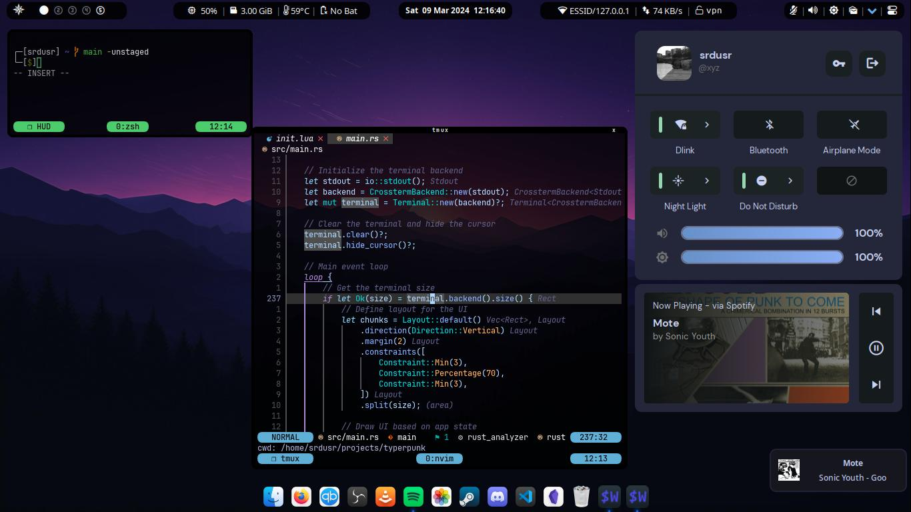

<pre>
<p align="center">
██████╗  ██████╗ ████████╗███████╗██╗██╗     ███████╗███████╗
██╔══██╗██╔═══██╗╚══██╔══╝██╔════╝██║██║     ██╔════╝██╔════╝
██║  ██║██║   ██║   ██║   █████╗  ██║██║     █████╗  ███████╗
██║  ██║██║   ██║   ██║   ██╔══╝  ██║██║     ██╔══╝  ╚════██║
██████╔╝╚██████╔╝   ██║   ██║     ██║███████╗███████╗███████║
╚═════╝  ╚═════╝    ╚═╝   ╚═╝     ╚═╝╚══════╝╚══════╝╚══════╝
</p>
</pre>

<h3 align="center">
Welcome, and make yourself at <b><i>$HOME</i></b>
</h3>



> Agnostic/cross-platform dotfiles (Linux/MacOS/Windows)

- This repository is designed to be a bare Git dotfiles repository located in your home directory. 
- Easy dotfiles management that respects the file hierarchy/XDG structure cross platform.
- Custom `config` command that intelligently manages files across different operating systems.

Example:
```bash
config add .bashrc # → linux/home/.bashrc
config add /etc/issue # → linux/etc/issue
config add README.md # → linux/home/README.md  (default, since no override)
config add --to=root README.md # → README.md (repo root)
config add --to=root docs/guide.md # → docs/guide.md (nested in repo root)
config add --to=common README.md # → common/README.md
config commit -m "Updated Dotfiles Management"
config push -u origin main
```

---

## Details

Linux:
- **OS:** [Gentoo Hardened](https://www.gentoo.org)
- **WM/Compositor:** [hyprland](https://hyprland.org)
- **Widgets:** [ags](https://aylur.github.io/ags)
- **Shell:** [zsh](https://zsh.org)
- **Terminal:** [wezterm](https://https://wezfurlong.org/wezterm)
- **Multiplexer:** [tmux](https://github.com/tmux/tmux/wiki)
- **Editor:** [neovim](https://neovim.io)
  - **Config:** [nvim](https://github.com/srdusr/nvim)
- **Fonts:**
  - **Icons:** Whitesur
  - **UI:** San Francisco
  - **Terminal:** JetBrains Mono

---

### Installing onto a new system (Manual)

1. Avoid weird behaviour/recursion issues when `.cfg` tries to track itself

```bash
$ echo ".cfg" >> .gitignore
```

2. Clone the repository

```bash
# Linux/MacOS
git clone --bare https://github.com/srdusr/dotfiles.git $HOME/.cfg

    Note: On Windows, you can use Git Bash or WSL. The process is the same.
```

```ps1
# Windows
git clone --bare https://github.com/srdusr/dotfiles.git $env:USERPROFILE/.cfg
```


3. Setup the `config` command/function

Linux/MacOS:
Copy and paste this into any profile/startup file ie. `~/.bashrc`, `~/.zshrc` etc.

<details>
  <summary><b>Bash/Zsh:</b> </summary>

```bash
# Dotfiles Management System
if [[ -d "$HOME/.cfg" && -d "$HOME/.cfg/refs" ]]; then

    # Core git wrapper with repository as work-tree
    _config() {
        git --git-dir="$HOME/.cfg" --work-tree="$HOME/.cfg" "$@"
    }

    # Detect OS
    case "$(uname -s)" in
        Linux)    CFG_OS="linux" ;;
        Darwin)   CFG_OS="macos" ;;
        MINGW*|MSYS*|CYGWIN*) CFG_OS="windows" ;;
        *)        CFG_OS="other" ;;
    esac

    # Map system path to repository path
    _repo_path() {
        local f="$1"

        # Already in repo structure - return as-is
        case "$f" in
            linux/*|macos/*|windows/*|common/*|profile/*|.*)
                echo "$f"
                return
                ;;
        esac

        # Convert absolute path to relative from HOME
        [[ "$f" = "$HOME"* ]] && f="${f#$HOME/}"

        # Default: put under OS-specific home
        echo "$CFG_OS/home/$f"
    }

    # Map repository path back to system path
    _sys_path() {
        local repo_path="$1"
        case "$repo_path" in
            */home/*) echo "$HOME/${repo_path#*/home/}" ;;
            *) echo "/$repo_path" ;;
        esac
    }

    # NOTE: can change `config` to whatever you feel comfortable ie. dotfiles, dots, cfg etc.
    config() {
        local cmd="$1"; shift
        case "$cmd" in
            add)
                local target_parent=""
                # Allow --to=namespace (root, common, linux, macos, windows, profile)
                while [[ "$1" =~ ^--to= ]]; do
                    target_parent="${1#--to=}"
                    shift
                done

                local file_path
                for file_path in "$@"; do
                    local repo_path
                    if [[ -n "$target_parent" ]]; then
                        case "$target_parent" in
                            root)
                                # Preserve relative path inside repo root
                                if [[ "$file_path" = /* ]]; then
                                    repo_path="$(basename "$file_path")"
                                else
                                    repo_path="$file_path"
                                fi
                                ;;
                            common|linux|macos|windows|profile)
                                repo_path="$target_parent/$file_path"
                                ;;
                            *)
                                echo "Unknown target parent: $target_parent" >&2
                                exit 1
                                ;;
                        esac
                    else
                        # Default repo mapping
                        repo_path="$(_repo_path "$file_path")"
                    fi

                    local full_repo_path="$HOME/.cfg/$repo_path"
                    mkdir -p "$(dirname "$full_repo_path")"
                    cp -a "$file_path" "$full_repo_path"
                    _config add "$repo_path"
                    echo "Added: $file_path -> $repo_path"
                done
                ;;

            rm)
                local file_path
                for file_path in "$@"; do
                    local repo_path="$(_repo_path "$file_path")"
                    _config rm "$repo_path"
                    rm -f "$HOME/.cfg/$repo_path"
                    echo "Removed: $file_path ($repo_path)"
                done
                ;;

            sync)
                local direction="${1:-to-repo}"; shift
                _config ls-files | while read -r repo_file; do
                    local sys_file="$(_sys_path "$repo_file")"
                    local full_repo_path="$HOME/.cfg/$repo_file"
                    if [[ "$direction" == "to-repo" ]]; then
                        if [[ -e "$sys_file" && -n "$(diff "$full_repo_path" "$sys_file")" ]]; then
                            cp "$sys_file" "$full_repo_path"
                            echo "Synced to repo: $sys_file"
                        fi
                    elif [[ "$direction" == "from-repo" ]]; then
                        if [[ -e "$full_repo_path" && -n "$(diff "$full_repo_path" "$sys_file")" ]]; then
                            mkdir -p "$(dirname "$sys_file")"
                            cp "$full_repo_path" "$sys_file"
                            echo "Synced from repo: $sys_file"
                        fi
                    fi
                done
                ;;
            
            status)
                # Auto-sync any modified files
                local auto_synced=()
                while read -r repo_file; do
                    local sys_file="$(_sys_path "$repo_file")"
                    local full_repo_path="$HOME/.cfg/$repo_file"
                    if [[ -e "$sys_file" && -e "$full_repo_path" ]]; then
                        if ! diff -q "$full_repo_path" "$sys_file" >/dev/null 2>&1; then
                            \cp -f "$sys_file" "$full_repo_path"
                            auto_synced+=("$repo_file")
                        fi
                    fi
                done < <(_config ls-files)
                if [[ ${#auto_synced[@]} -gt 0 ]]; then
                    echo "=== Auto-synced Files ==="
                    for repo_file in "${auto_synced[@]}"; do
                        echo "synced: $(_sys_path "$repo_file") → $repo_file"
                    done
                    echo
                fi
                _config status
                echo
                ;;

            deploy)
                _config ls-files | while read -r repo_file; do
                    local sys_file="$(_sys_path "$repo_file")"
                    local full_repo_path="$HOME/.cfg/$repo_file"
                    if [[ -e "$full_repo_path" ]]; then
                        mkdir -p "$(dirname "$sys_file")"
                        cp -a "$full_repo_path" "$sys_file"
                        echo "Deployed: $repo_file -> $sys_file"
                    fi
                done
                ;;

            *)
                _config "$cmd" "$@"
                ;;
        esac
    }
fi
```

  </details>

Windows: 
Paste the PowerShell code block directly into your PowerShell profile. 
To find your profile path, simply run `$PROFILE` in your terminal. You can open and edit it with `notepad $PROFILE`.
If the file doesn't exist, you can create it
```ps1
New-Item -Path $PROFILE -ItemType File -Force
```

<details>
  <summary><b>PowerShell:</b> </summary>

```ps1
# Dotfiles Management System
if (Test-Path "$HOME/.cfg" -and Test-Path "$HOME/.cfg/refs") {

    function _config {
        git --git-dir="$HOME/.cfg" --work-tree="$HOME/.cfg" @Args
    }

    # Detect OS (cross-platform, PowerShell-native)
    $osPlatform = [System.Runtime.InteropServices.RuntimeInformation]::IsOSPlatform
    if ($osPlatform([System.Runtime.InteropServices.OSPlatform]::Windows)) {
        $global:CFG_OS = "windows"
    } elseif ($osPlatform([System.Runtime.InteropServices.OSPlatform]::Linux)) {
        $global:CFG_OS = "linux"
    } elseif ($osPlatform([System.Runtime.InteropServices.OSPlatform]::OSX)) {
        $global:CFG_OS = "macos"
    } else {
        $global:CFG_OS = "other"
    }

    # Map system path to repository path
    function _repo_path {
        param([string]$f)

        switch -Regex ($f) {
            "^(linux/|macos/|windows/|common/|profile/|\.).*" { return $f }
        }

        if ($f -like "$HOME*") {
            $f = $f.Substring($HOME.Length).TrimStart("\","/")
        }

        return "$CFG_OS/home/$f"
    }

    # Map repository path back to system path
    function _sys_path {
        param([string]$repo_path)

        if ($repo_path -match ".*?/home/.*") {
            return Join-Path $HOME ($repo_path -replace ".*?/home/", "")
        } else {
            if ($CFG_OS -eq "windows") {
                return Join-Path $HOME $repo_path
            } else {
                return "/$repo_path"
            }
        }
    }

    # Main config wrapper
    function config {
        param(
            [string]$cmd,
            [Parameter(ValueFromRemainingArguments = $true)]
            [string[]]$args
        )

        switch ($cmd) {

            "add" {
                $target_parent = $null

                # Parse optional --to= argument
                while ($args.Count -gt 0 -and $args[0] -like "--to=*") {
                    $target_parent = $args[0] -replace "^--to=", ""
                    $args = $args[1..($args.Count-1)]
                }

                foreach ($file_path in $args) {
                    $repo_path = $null

                    if ($target_parent) {
                        switch ($target_parent) {
                            "root" {
                                # preserve relative path inside repo root
                                if ([System.IO.Path]::IsPathRooted($file_path)) {
                                    $repo_path = $file_path.TrimStart("\","/")
                                } else {
                                    $repo_path = $file_path
                                }
                            }
                            "common"|"linux"|"macos"|"windows"|"profile" {
                                $repo_path = Join-Path $target_parent $file_path
                            }
                            default {
                                Write-Error "Unknown target parent: $target_parent"
                                return
                            }
                        }
                    } else {
                        $repo_path = _repo_path $file_path
                    }

                    $full_repo_path = Join-Path "$HOME/.cfg" $repo_path
                    New-Item -ItemType Directory -Force -Path (Split-Path $full_repo_path) | Out-Null
                    Copy-Item -Path $file_path -Destination $full_repo_path -Recurse -Force
                    _config add $repo_path
                    Write-Output "Added: $file_path -> $repo_path"
                }
            }

            "rm" {
                foreach ($file_path in $args) {
                    $repo_path = _repo_path $file_path
                    _config rm $repo_path
                    Remove-Item -Force -Path (Join-Path "$HOME/.cfg" $repo_path)
                    Write-Output "Removed: $file_path ($repo_path)"
                }
            }

            "sync" {
                $direction = if ($args.Count -gt 0) { $args[0] } else { "to-repo" }

                _config ls-files | ForEach-Object {
                    $repo_file = $_
                    $sys_file = _sys_path $repo_file
                    $full_repo_path = Join-Path "$HOME/.cfg" $repo_file

                    if ($direction -eq "to-repo") {
                        if (Test-Path $sys_file -and -not (Compare-Object (Get-Content $full_repo_path -Raw) (Get-Content $sys_file -Raw))) {
                            Copy-Item -Path $sys_file -Destination $full_repo_path -Force
                            Write-Output "Synced to repo: $sys_file"
                        }
                    } elseif ($direction -eq "from-repo") {
                        if (Test-Path $full_repo_path -and -not (Compare-Object (Get-Content $full_repo_path -Raw) (Get-Content $sys_file -Raw))) {
                            New-Item -ItemType Directory -Force -Path (Split-Path $sys_file) | Out-Null
                            Copy-Item -Path $full_repo_path -Destination $sys_file -Force
                            Write-Output "Synced from repo: $sys_file"
                        }
                    }
                }
            }

            "status" {
                $auto_synced = @()
                _config ls-files | ForEach-Object {
                    $repo_file = $_
                    $sys_file = _sys_path $repo_file
                    $full_repo_path = Join-Path "$HOME/.cfg" $repo_file

                    if (Test-Path $sys_file -and Test-Path $full_repo_path) {
                        if (Compare-Object (Get-Content $full_repo_path -Raw) (Get-Content $sys_file -Raw)) {
                            Copy-Item -Path $sys_file -Destination $full_repo_path -Force
                            $auto_synced += $repo_file
                        }
                    }
                }
                if ($auto_synced.Count -gt 0) {
                    Write-Output "=== Auto-synced Files ==="
                    foreach ($repo_file in $auto_synced) {
                        Write-Output "synced: $(_sys_path $repo_file) → $repo_file"
                    }
                    Write-Output ""
                }
                _config status
                Write-Output ""
            }

            "deploy" {
                _config ls-files | ForEach-Object {
                    $repo_file = $_
                    $sys_file = _sys_path $repo_file
                    $full_repo_path = Join-Path "$HOME/.cfg" $repo_file

                    if (Test-Path $full_repo_path) {
                        New-Item -ItemType Directory -Force -Path (Split-Path $sys_file) | Out-Null
                        Copy-Item -Path $full_repo_path -Destination $sys_file -Recurse -Force
                        Write-Output "Deployed: $repo_file -> $sys_file"
                    }
                }
            }

            default {
                _config $cmd @args
            }
        }
    }
}
```

  </details>

4. Make sure to not show untracked files

```bash
config config --local status.showUntrackedFiles no
```


5. Deploy dotfiles

```bash
config deploy
```


---

### Auto-installer

Linux/MacOS:

```bash
wget -q "https://github.com/srdusr/dotfiles/archive/main.tar.gz" -O "$HOME/Downloads/dotfiles.tar.gz"
mkdir -p "$HOME/dotfiles-main"
tar -xf "$HOME/Downloads/dotfiles.tar.gz" -C "$HOME/dotfiles-main" --strip-components=1
mv -f "$HOME/dotfiles-main/"* "$HOME"
rm -rf "$HOME/dotfiles-main"
chmod +x "$HOME/install.sh"
rm "$HOME/Downloads/dotfiles.tar.gz"
$HOME/install.sh
```

Windows:

```ps1
Set-ExecutionPolicy RemoteSigned -Scope CurrentUser -Force; `
$ProgressPreference = 'SilentlyContinue'; `
Invoke-WebRequest "https://github.com/srdusr/dotfiles/archive/main.zip" `
-OutFile "$HOME\Downloads\dotfiles.zip"; `
Expand-Archive -Path "$HOME\Downloads\dotfiles.zip" -DestinationPath "$HOME" -Force; `
Move-Item -Path "$HOME\dotfiles-main\*" -Destination "$HOME" -Force; `
Remove-Item -Path "$HOME\dotfiles-main" -Recurse -Force; `
. "$HOME\install.bat"


Set-ExecutionPolicy RemoteSigned -Scope CurrentUser -Force
irm 'https://raw.githubusercontent.com/srdusr/dotfiles/main/windows/Documents/PowerShell/bootstrap.ps1' | iex
```

---

<details>
  <summary><b>Notes</b> (If you have some time to read)</summary>

### Fzf

- Install Fzf

```
$ sudo git clone --depth 1 https://github.com/junegunn/fzf.git /usr/local/bin/fzf
```

- Put this into `.bashrc`/`.zshrc` or any similar shell configuration file to make it persistent across sessions

```bash
export PATH="$PATH:/usr/local/bin/fzf/bin"
export FZF_BASE="/usr/local/bin/fzf"
```

- Also put this in to load fzf keybindings and completions

```bash
# bash
source /usr/local/bin/fzf/shell/key-bindings.bash
source /usr/local/bin/fzf/shell/completion.bash
```

```bash
# zsh
source /usr/local/bin/fzf/shell/key-bindings.zsh
source /usr/local/bin/fzf/shell/completion.zsh
```

---

### Zsh plugins

- Install the plugins

```bash
# Clone zsh-you-should-use
$ git clone https://github.com/MichaelAquilina/zsh-you-should-use.git ~/.config/zsh/plugins/zsh-you-should-use

# Clone zsh-syntax-highlighting
$ git clone https://github.com/zsh-users/zsh-syntax-highlighting.git ~/.config/zsh/plugins/zsh-syntax-highlighting

# Clone zsh-autosuggestions
$ git clone https://github.com/zsh-users/zsh-autosuggestions.git ~/.config/zsh/plugins/zsh-autosuggestions
```

- Put this into `.zshrc` (preferably at the very end of the file) to allow it to source the plugins across sessions

```bash
# Suggest aliases for commands
source ~/.config/zsh/plugins/zsh-you-should-use/you-should-use.plugin.zsh

# Load zsh-syntax-highlighting
source ~/.config/zsh/plugins/zsh-syntax-highlighting/zsh-syntax-highlighting.zsh

# Load fish like auto suggestions
source ~/.config/zsh/plugins/zsh-autosuggestions/zsh-autosuggestions.plugin.zsh
source ~/.config/zsh/plugins/zsh-autosuggestions/zsh-autosuggestions.zsh
```

---

### Wezterm

- Make sure Rust is installed first

```bash
$ curl https://sh.rustup.rs -sSf | sh -s
```

- Install and build Wezterm

```bash
$ git clone --depth=1 --branch=main --recursive https://github.com/wez/wezterm.git
$ cd wezterm
$ git submodule update --init --recursive
$ ./get-deps
$ cargo build --release
$ cargo run --release --bin wezterm -- start
$ sudo install wezterm wezterm-gui wezterm-mux-server strip-ansi-escapes /usr/local/bin

```

---

### Neovim

> Dependencies

| Platform           | ninja-build | ninja | base-devel | build-base | coreutils | gmake | cmake | make | gcc | g++ | gcc-c++ | unzip | wget | curl | gettext | gettext-tools | gettext-tiny-dev | automake | autoconf | libtool | libtool-bin | pkg-config | pkgconfig | pkgconf | tree-sitter | patch | doxygen | sha | git | Pack Manager |
| ------------------ | ----------- | ----- | ---------- | ---------- | --------- | ----- | ----- | ---- | --- | --- | ------- | ----- | ---- | ---- | ------- | ------------- | ---------------- | -------- | -------- | ------- | ----------- | ---------- | --------- | ------- | ----------- | ----- | ------- | --- | --- | ------------ |
| Ubuntu/Debian      | ✓           |       |            |            |           |       | ✓     |      |     | ✓   |         | ✓     |      | ✓    | ✓       |               |                  | ✓        | ✓        | ✓       | ✓           | ✓          |           |         |             |       | ✓       |     |     | apt-get      |
| CentOS/RHEL/Fedora | ✓           |       |            |            |           |       | ✓     | ✓    | ✓   |     | ✓       | ✓     |      | ✓    | ✓       |               |                  | ✓        | ✓        | ✓       |             |            | ✓         |         |             | ✓     |         |     |     | dnf          |
| openSUSE           |             | ✓     |            |            |           |       | ✓     |      |     |     | ✓       |       |      | ✓    |         | ✓             |                  | ✓        | ✓        | ✓       |             |            |           |         |             |       |         |     |     | zypper       |
| Arch Linux         |             | ✓     | ✓          |            |           |       | ✓     |      |     |     |         | ✓     |      | ✓    |         |               |                  |          |          |         |             |            |           |         | ✓           |       |         |     |     | pacman       |
| Alpine Linux       |             |       |            |            | ✓         |       | ✓     |      |     |     |         | ✓     |      | ✓    |         |               | ✓                | ✓        | ✓        | ✓       |             |            |           | ✓       |             |       |         |     |     | apk          |
| Void Linux         |             |       | ✓          | ✓          |           |       | ✓     |      |     |     |         |       |      | ✓    |         |               |                  |          |          |         |             |            |           |         |             |       |         |     | ✓   | xbps         |
| FreeBSD            |             |       |            |            |           | ✓     | ✓     |      |     |     |         | ✓     | ✓    | ✓    | ✓       |               |                  |          |          | ✓       |             |            |           | ✓       |             |       |         | ✓   |     | pkg          |
| OpenBSD            |             |       |            |            |           | ✓     | ✓     |      |     |     |         | ✓     |      | ✓    |         | ✓             |                  | ✓        | ✓        | ✓       |             |            |           |         |             |       |         |     |     | pkg_add      |
| macOS/Homebrew     |             | ✓     |            |            |           |       | ✓     |      |     |     |         |       |      | ✓    | ✓       |               |                  | ✓        |          | ✓       |             | ✓          |           |         |             |       |         |     |     | brew         |
| macOS/MacPorts     |             | ✓     |            |            |           |       | ✓     |      |     |     |         |       |      |      | ✓       |               |                  |          |          |         |             |            |           |         |             |       |         |     |     | port         |

- Install (default is nightly)
  ```bash
  $ git clone https://github.com/neovim/neovim.git
  $ cd neovim
  ```
  - Optional install stable version
  ```bash
  $ git checkout stable
  ```
  - or specific version by tag
  ```bash
  $ git checkout release-0.7
  ```
- Build nvim
  ```bash
  $ make CMAKE_BUILD_TYPE=Release
  $ sudo make install
  ```
- Install Packer (package manager)
  ```bash
  $ git clone --depth 1 https://github.com/wbthomason/packer.nvim\
  ~/.local/share/nvim/site/pack/packer/start/packer.nvim
  ```
- Post-installation:
  - Install plugins
  ```vi
  :PackerSync
  ```
  - or save/write on .config/nvim/lua/user/pack.lua to automatically install plugins
  ```vi
  :w
  ```
  - Install language servers
  ```vi
  :Mason
  ```
  - Exit out of Mason with `q`, configured language servers should then install automatically
    > NOTE: If any errors occur, npm needs to be installed and executable, complete **_Development Environment/Languages/Javascript_** section to install nvm/npm
  - Reload nvim/config with `<leader><space>` where `<leader>` is `;`
- Uninstall:
  ```bash
  $ sudo rm /usr/local/bin/nvim
  $ sudo rm -r /usr/local/share/nvim/
  ```

---

### Gnome Custom Settings

- Run gnome custom settings script, located at `~/.scripts`:

```bash
$ gsettings.sh
```

---

## Development Environment

### Languages

#### Python

```bash

```

---

#### Java

Recommended to choose Openjdk 8 or 10 otherwise get an error when using Android tools

```bash

```

---

#### Rust

- Download and run rustup script

```bash
$ curl --proto '=https' --tlsv1.2 -sSf https://sh.rustup.rs | sh -s -- --no-modify-path --default-toolchain stable -y
```

---

#### Go

```bash

```

---

#### Lua

- Download LuaRocks

```bash
$ git clone git://github.com/luarocks/luarocks.git
```

- Install and specify the installation directory to build and configure LuaRocks

```bash
$ ./configure --prefix=/usr/local/luarocks
$ make build
$ sudo make install
```

- Add LuaRocks to system's environment variables by running the following command or add it `.bashrc`/`.zshrc` or any similar shell configuration file to make it persistent across sessions

```bash
export PATH=$PATH:/usr/local/luarocks/bin
```

- Install Lua

```bash
$ luarocks install lua
```

---

#### PHP

- Install PHP
- Install Web server (Apache or Nginx)
- Install PHP extensions

```
php-apache php-cgi php-fpm php-gd  php-embed php-intl php-redis php-snmp
mysql-server php8.1-mysql
phpmyadmin
```

- Install composer (Dependency Manager for PHP)

```bash
$ curl -sS https://getcomposer.org/installer | php
```

- Install laravel

```bash
$ composer global require laravel/installer
```

- Edit PHP config

```bash
$ sudoedit /etc/php/php.ini
```

- Enable PHP extensions, make sure these lines are uncommented (remove the `;` from each line)

```
extention=bcmath
extention=zip
extension=pdo_mysql
extension=mysqli
extension=iconv

extension=gd
extension=imagick
extension=pdo_pgsql
extension=pgsql
```

- Recommended to set correct timezone

```
date.timezone = <Continent/City>
```

- Display errors to debug PHP code

```
display_errors = On
```

- Allow paths to be accessed by PHP

```
open_basedir = /srv/http/:/var/www/:/home/:/tmp/:/var/tmp/:/var/cache/:/usr/share/pear/:/usr/share/webapps/:/etc/webapps/
```

---

#### Dart

- Install dart or skip and install flutter (recommended) that includes dart

```bash
$ curl -O "https://storage.googleapis.com/dart-archive/channels/be/raw/latest/sdk/dartsdk-linux-x64-release.zip"
$ unzip dartsdk-linux-x64-release.zip
$ sudo mv dart-sdk /usr/lib/dart
```

NOTE: If Dart SDK is downloaded separately, make sure that the Flutter version of dart is first in path, as the two versions might not be compatible. Use this command `which flutter dart` to see if flutter and dart originate from the same bin directory and are therefore compatible.

- Install flutter

```bash
$ git clone https://github.com/flutter/flutter.git -b stable
```

- Move flutter to the `/opt` directory

```bash
$ sudo mv flutter /opt/
```

- Export Flutter over Dart by putting this into `.bashrc`/`.zshrc` or any similar shell configuration file to make it persistent across sessions

```bash
# Flutter/dart path
export PATH="/opt/flutter:/usr/lib/dart/bin:$PATH"
# Flutter Web Support
export PATH=$PATH:/opt/google/chrome
```

- Set permissions since only Root has access

```bash
$ sudo groupadd flutterusers
$ sudo gpasswd -a $USER flutterusers
$ sudo chown -R :flutterusers /opt/flutter
$ sudo chmod -R g+w /opt/flutter/
```

- If still getting any permission denied errors then do this

```bash
$ sudo chown -R $USER /opt/flutter
```

- Continue to step **_Development Tools/Android Studio_** section to complete setup

---

#### Javascript

- nvm install/update script

```bash
$ curl -o- https://raw.githubusercontent.com/nvm-sh/nvm/v0.39.3/install.sh | bash
```

- Put these lines into `.bashrc`/`.zshrc` or any similar shell configuration file to make it persistent across sessions

```bash
export NVM_DIR="$([ -z "${XDG_CONFIG_HOME-}" ] && printf %s "${HOME}/.nvm" || printf %s "${XDG_CONFIG_HOME}/nvm")"
[ -s "$NVM_DIR/nvm.sh" ] && \. "$NVM_DIR/nvm.sh" # This loads nvm
```

- Install node

```bash
$ nvm install node
```

- Install the latest version in order to make npm executable

```bash
$ nvm install --lts
```

---

### Development Tools

#### MySQL

- Install MySQL
- Ensure the MySQL service starts when reboot or startup machine.

```bash
$ sudo systemctl start mysqld
```

- Setup MySQL for use

```bash
$ sudo mysql_secure_installation
```

- To check its installed and working just open up mysql command prompt with

```
$ sudo mysql
```

---

#### Android Studio/SDK

> NOTE: Android Studio is an Integrated Development Environment (IDE) that provides a comprehensive set of tools for Android app development. It includes the Android SDK (Software Development Kit), which consists of various libraries, tools, and system images necessary for developing Android applications.

> The Android SDK can be installed separately without Android Studio, allowing you to use alternative text editors or IDEs for development. However, Android Studio provides a more streamlined and feature-rich development experience.

> Make sure to properly set the Java environment (either 8 or 10, eg., java-8-openjdk) otherwise android-studio will not start.

> If Android Studio shows up as a blank window try exporting `_JAVA_AWT_WM_NONREPARENTING=1`.

- Install android studio
  - Directly from the official website
  ```bash
  $ curl -L -o android-studio.tar.gz "$(curl -s "https://developer.android.com/studio#downloads" | grep -oP 'https://redirector\.gvt1\.com/[^"]+' | head -n 1)"
  $ tar -xvzf android-studio.tar.gz
  $ sudo mv android-studio /opt/
  $ cd /opt/android-studio/bin script # Configure Android Studio by running this script
  $ ./studio.sh
  ```
  - Or optionally install jetbrains-toolbox that includes android-studio amongst many other applications/tools from jetbrains
  ```bash
  $ latest_url=$(curl -sL "https://data.services.jetbrains.com/products/releases?code=TBA" | grep -oP 'https://download.jetbrains.com/toolbox/jetbrains-toolbox-\d+\.\d+\.\d+\.\d+\.tar\.gz' | head -n 1) && curl -L -o jetbrains-toolbox.tar.gz "$latest_url"
  $ tar -xvzf jetbrains-toolbox.tar.gz
  $ sudo mv jetbrains-toolbox /opt/jetbrains
  ```
- Complete the Android Studio Setup Wizard
  - Click `Next` on the Welcome Window
  - Click `Custom` and `Next`
  - Make sure `/opt/android-sdk` directory exists otherwise create it by typing in the following command in a terminal
  ```bash
  $ sudo mkdir /opt/android-sdk
  ```
  - Click on the folder icon next to the SDK path field.
  - In the file picker dialog, navigate to the /opt directory and select the android-sdk directory.
  - Proceed with the setup wizard, following the remaining instructions to complete the installation.
- If already installed and prefer not to have a `$HOME/Android` directory but rather use `/opt/android-sdk`

  - Launch Android Studio.
  - Go to "File" > "Settings" (on Windows/Linux) or "Android Studio" > "Preferences" (on macOS) to open the settings.
  - In the settings, navigate to "Appearance & Behavior" > "System Settings" > "Android SDK".
  - In the "Android SDK Location" field, update the path to `/opt/android-sdk`.
  - Click "Apply" or "OK" to save the settings.

- Put these lines into `.bashrc`/`.zshrc` or any similar shell configuration file to make it persistent across sessions

```
# Android Home
export ANDROID_HOME=/opt/android-sdk
export PATH=$ANDROID_HOME/tools:$PATH
export PATH=$ANDROID_HOME/tools/bin:$PATH
export PATH=$ANDROID_HOME/platform-tools:$PATH
export PATH=$ANDROID_HOME/cmdline-tools/latest/bin:$PATH
# Android emulator PATH
export PATH=$ANDROID_HOME/emulator:$PATH
# Android SDK ROOT PATH
export ANDROID_SDK_ROOT=/opt/android-sdk
export PATH=$ANDROID_SDK_ROOT:$PATH
# Alias for android-studio
alias android-studio='/opt/android-studio/bin/studio.sh'
```

- Android SDK and tools installation
  > NOTE: Can be installed either through Android Studio or separately.
  - Android Studio Installed: Launch Android Studio and go to the "SDK Manager" (usually found under "Configure" or "Preferences" menu). From the SDK Manager, select the desired SDK components (platforms, build tools, system images, etc.) and click "Apply" to install them.
  - To install Android SDK separately (without Android Studio):
  ```bash
  $ curl -L -o commandlinetools.zip "$(curl -s "https://developer.android.com/studio#downloads" | grep -oP 'https://dl.google.com/android/repository/commandlinetools-linux-\d+_latest\.zip' | head -n 1)"
  $ unzip commandlinetools.zip -d android-sdk
  $ mkdir android-sdk/cmdline-tools/latest
  $ sudo mv android-sdk /opt/
  or
  $ sudo mv android-sdk/cmdline-tools /opt/android-sdk/
  ```
- If Android SDK was installed separately then configure the user's permissions since android-sdk is installed in /opt/android-sdk directory

```bash
$ sudo groupadd android-sdk
$ sudo gpasswd -a $USER android-sdk
$ sudo setfacl -R -m g:android-sdk:rwx /opt/android-sdk
$ sudo setfacl -d -m g:android-sdk:rwX /opt/android-sdk
```

- If Android SDK has been installed separately then install platform-tools and build-tools like this:
  - First list `sdkmanager`'s available/installed packages
  ```bash
  $ sdkmanager --list
  ```
  - Install platform-tools and build-tools
    > NOTE: Replace <version> with the specific version number for platforms and build tools to install (e.g., "platforms;android-`33`" "build-tools;`34.0.0`").
  ```bash
  $ sdkmanager "platform-tools" "platforms;android-<version>" "build-tools;<version>"
  ```
- Android emulator
  - List of available android system images.
  ```bash
  $ sdkmanager --list
  ```
  - Install an android image of your choice. For example.
  ```bash
  $ sdkmanager --install "system-images;android-29;default;x86"
  ```
  - Then create an android emulator using Android Virtual Devices Manager
  ```bash
  $ avdmanager create avd -n <name> -k "system-images;android-29;default;x86"
  ```
- Continuing from **_Dart(flutter)_** section
  - Update Flutter Config SDK PATH for custom SDK PATH
  ```bash
  $ flutter config --android-sdk /opt/android-sdk
  ```
  - Accept all andfoid licenses with this command
  ```
  $ flutter doctor --android-licenses
  ```
  - If licenses are still not accepted even after running `flutter doctor --android-licenses` try these commands and then run `flutter doctor --android-licenses again`
  ```
  $ sudo chown -R $(whoami) $ANDROID_SDK_ROOT
  ```
  - Run this
  ```
  $ flutter doctor
  ```
- Update emulator binaries

```bash
$ sdkmanager --sdk_root=${ANDROID_HOME} tools
```

- Accept emulator licenses
  > NOTE: Required to accept the necessary license for each package installed.

```bash
$ sdkmanager --licenses
```

---

## Commands

---

#### Windows

- Install nvim natively to Windows
  - First allow script execution, run the following command in PowerShell as an administrator:
  ```dos
    Set-ExecutionPolicy RemoteSigned
    # or
    Set-ExecutionPolicy RemoteSigned -Scope CurrentUser
  ```
  - Then run the script by using this command in the same existing directory:
  ```dos
  ./win-nvim.ps1
  ```
  ```dos
  curl -o winget-cli.appxbundle https://aka.ms/winget-cli-appxbundle
  powershell Add-AppxPackage -Path  "winget-cli.appxbundle"
  Set-ExecutionPolicy Bypass -Scope Process -Force; [System.Net.ServicePointManager]::SecurityProtocol = [System.Net.ServicePointManager]::SecurityProtocol -bor 3072; iex ((New-Object System.Net.WebClient).DownloadString('https://community.chocolatey.org/install.ps1'))
  ```
  - Use `-y` or consider: choco feature enable -n allowGlobalConfirmation
  ```dos
  choco install git
  ```
  - Refresh the environment
  ```dos
  Import-Module $env:ChocolateyInstall\helpers\chocolateyProfile.psm1
  refreshenv
  ```
  ```dos
  git config --global user.name "Firstname Lastname"
  git config --global user.email "your_email@example.com"
  ```
  </details>
